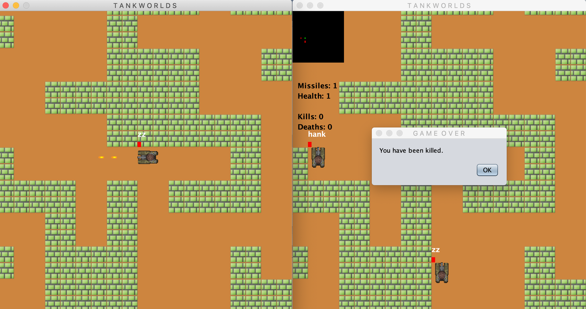

## TANK WORLDS

A SHOOT EM UP GAME BY:

MFUNDO CELE 
MORGAN MOSS 
MAGDALEEN DE WET 
SISIPHO FIKIZOLO 

## CONTROLS:

USE ARROW KEYS TO MOVE: 
UP = FORWARD 
DOWN = BACK 
LEFT = TURN LEFT 
RIGHT = TURN RIGHT 

SPACE = SHOOT 
R = RELOAD 
H = REPAIR HEALTH 
S = SHOW STATE AND MINIMAP 
B = SHOW COLLISION AND RANGE LINES 
ESC = QUIT 

## SETUP:

RUN THE SERVER: 
open the server.jar folder in your terminal 
use the command "java -jar toy-robot-world-mmms.jar" 

RUN THE CLIENT: 
just double click the .jar file! 

## USING THE SERVER:

DUMP = GET INFO ON ALL SERVER COMPONENTS 
ROBOTS = GET LIST OF ALL ROBOTS 
QUIT = EXIT THE SERVER AND CLOSE ALL CLIENTS 
